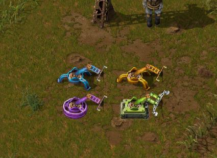

This is a way to fix the Factorio graphics for colourblind people **without** using a mod and without losing your achievements.

## What's changed

-Science packs have been updated to have a different shape for each pack. (Space pack is also included but not pictured below.)
- Green wire has been replaced by blue.
- The logistics network overlay has been updated to make it clearer.
- Circuits updated.
- Oil/lubricant updated.
- Stack inserters updated with square base.

Science packs, circuits and wires:

Oil:

Logistics network:

Stack inserter vs normal inserter:

## How to install

1. Close Factorio.
2. Go to your Factorio install folder.
3. Open the `data` folder.
4. Copy the `base` and `core` folders from this repo into your `Factorio/data` folder, and choose to overwrite existing files.
5. You're done!

## Making your own changes

If, for example, you don't like the colours of the wires above, it is super easy to make your own unique colours:

1. Go to your Factorio install folder. Most graphic files are in Factorio/data/base/graphics/icons
2. Open the file in an image editor.
3. Change the hue using a Hue/Saturation slider to something that's distinct to you. That's all you really need to do.

## Credits

Credit to [Hornwitser](https://mods.factorio.com/user/hornwitser) for the science pack graphics from their [cb-science mod](https://mods.factorio.com/mod/cb-science).
As per [the licence](https://creativecommons.org/licenses/by-nc-nd/4.0/), no derivative works have been made
and the original content has been included verbatim.

Credit to [RedditNamesAreShort](https://www.reddit.com/r/factorio/comments/6ba2jj/im_color_blind_and_cant_see_the_orange_and_green/dhkxnv8/) for showing that it was possible to change these graphics 
without using a mod.

Credit to [BadWolfHS](https://www.reddit.com/r/factorio/comments/6ba2jj/im_color_blind_and_cant_see_the_orange_and_green/) for the logistic network overlay and for inspiring this collection.
